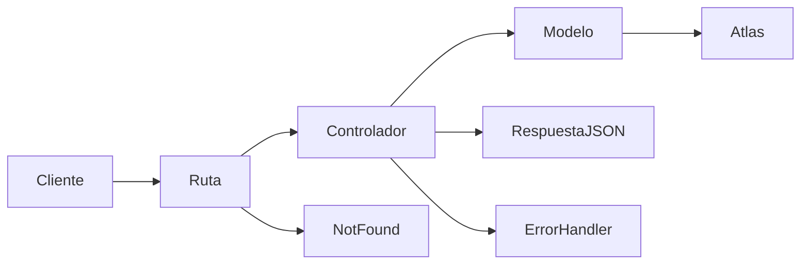

# API Nana Nocturna

API REST para consultar y gestionar las piezas de Nana Nocturna. Está construida con Node.js, Express y Mongoose, y se conecta a MongoDB Atlas.

## Estructura

```text
backend/
├── api/
│   └── index.js
├── src/
│   ├── config/
│   │   └── db.js
│   ├── controllers/
│   │   └── productController.js
│   ├── middlewares/
│   │   ├── errorHandler.js
│   │   └── notFound.js
│   ├── models/
│   │   ├── Pieza.js
│   │   └── Usuarios.js
│   ├── routes/
│   │   └── productRoutes.js
│   ├── utils/
│   │   └── httpError.js
│   └── app.js
├── tests/
│   ├── requests.http
│   └── API Nana Nocturna.postman_collection.json
├── .env.example
├── .gitignore
├── package.json
└── server.js
```

## Modelos

### Pieza

El modelo `Pieza` utiliza la colección existente `piezas` en MongoDB. Sus campos incluyen `nombre`, `descripcion`, `categoria`, `precio`, `estado`, `disponible`, `imagen`, `imagenesGaleria`, `materiales`, `medidas`, `coleccion`, `piezaUnica`, `personalizable`, `fechaCreacion` y `creadoPor`.

### User

El modelo `User` utiliza la colección `usuarios`. Su esquema incluye `nombre`, `email`, `password`, `rol`, `activo` y `fechaRegistro`. Este proyecto define el modelo, pero no ofrece endpoints CRUD para usuarios.

## Endpoints

La entidad principal se expone bajo `/api/products`, aunque el modelo y la colección de MongoDB se llaman `Pieza` y `piezas`.

| Método | Ruta | Descripción |
|---|---|---|
| GET | `/api/products` | Obtiene todas las piezas |
| GET | `/api/products/:id` | Obtiene una pieza por su ID |
| POST | `/api/products` | Crea una pieza |
| PUT | `/api/products/:id` | Actualiza una pieza por su ID |
| DELETE | `/api/products/:id` | Elimina una pieza por su ID |

Las respuestas de éxito y error se devuelven en formato JSON. Una ruta inexistente responde con estado 404. Los errores gestionados por el servidor pasan por el middleware centralizado.

## Requisitos

- Node.js y npm.
- Un clúster de MongoDB Atlas.
- Un usuario de base de datos de Atlas con permisos para acceder a la base de datos.
- La IP desde la que se conecta debe estar permitida en la lista de acceso de red de Atlas.

## Instalación y ejecución local

Desde una terminal, entra en la carpeta `backend` e instala las dependencias:

```powershell
npm.cmd install
```

Crea un archivo `.env` a partir de `.env.example` y añade la URI de conexión de Atlas. Luego inicia el servidor de desarrollo:

```powershell
npm.cmd run dev
```

Por defecto, la API local utiliza `http://localhost:3000`.

## Variables de entorno

Configura estas variables en `backend/.env`:

```env
MONGODB_URI=mongodb+srv://<usuario>:<contraseña>@<cluster>.mongodb.net/nana_nocturna?retryWrites=true&w=majority&appName=Cluster0
PORT=3000
```

Sustituye los valores de ejemplo por los de tu proyecto. No subas `.env` a GitHub ni compartas la URI real. El archivo `.gitignore` excluye `.env` del repositorio.

## Pruebas

Las peticiones locales se pueden enviar desde REST Client de VS Code con `tests/requests.http` o desde Postman con `tests/API Nana Nocturna.postman_collection.json`.

El POST crea un documento nuevo. Para probar PUT y DELETE, utiliza el ID de una pieza de prueba y confirma que ese es el documento que deseas modificar o borrar.

## Despliegue

La configuración y verificación del despliegue en Vercel están pendientes. Cuando esté desplegada, añade aquí la URL pública de la API y configura `MONGODB_URI` en las variables de entorno del proyecto de Vercel.

- URL de la API: pendiente.
- Repositorio de GitHub: pendiente.

## Flujo de una petición

