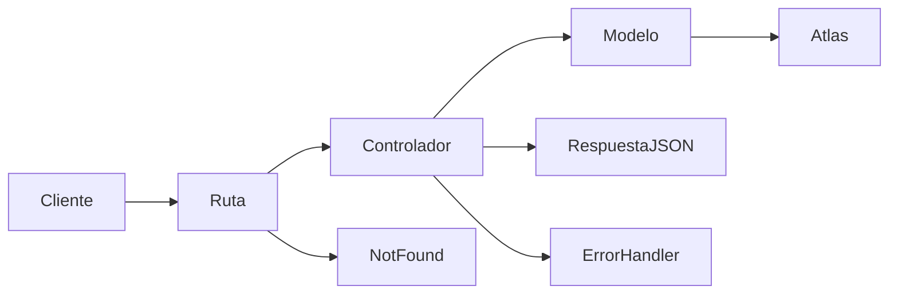

# API Nana Nocturna

API REST para consultar y gestionar las piezas de Nana Nocturna. Está construida con Node.js, Express y Mongoose, y se conecta a la base de datos `nana_nocturna` de MongoDB Atlas.

- Repositorio: [nana-nocturna-api](https://github.com/nadiamoukrimg/nana-nocturna-api)
- URL de Vercel: pendiente de despliegue.

## Tecnologías

- Node.js
- Express
- Mongoose
- MongoDB Atlas

## Estructura del backend

```text
nana-nocturna-api/
├── src/
│   ├── config/
│   │   └── db.js
│   ├── controllers/
│   │   └── productController.js
│   ├── middlewares/
│   │   ├── errorHandler.js
│   │   └── notFound.js
│   ├── models/
│   │   ├── Pieza.js
│   │   └── Usuarios.js
│   ├── routes/
│   │   └── productRoutes.js
│   ├── utils/
│   │   └── httpError.js
│   └── app.js
├── tests/
│   ├── requests.http
│   └── API Nana Nocturna.postman_collection.json
├── .env.example
├── .gitignore
├── package.json
└── server.js
```

### Responsabilidades

- `src/config/db.js`: conecta Mongoose con MongoDB Atlas usando `MONGODB_URI`.
- `src/models/`: define los esquemas de Mongoose.
- `src/controllers/productController.js`: implementa las operaciones CRUD de piezas.
- `src/routes/productRoutes.js`: enlaza los métodos HTTP con sus controladores.
- `src/middlewares/`: devuelve respuestas JSON para rutas inexistentes y errores.
- `src/app.js`: configura Express y sus rutas; Vercel detecta y despliega esta aplicación Express.
- `server.js`: inicia el servidor local.
- `tests/`: contiene las peticiones de prueba para REST Client y Postman.

## Modelos

### Pieza

El modelo `Pieza` usa explícitamente la colección existente `piezas`. Incluye estos campos: `nombre`, `descripcion`, `categoria`, `precio`, `estado`, `disponible`, `imagen`, `imagenesGaleria`, `materiales`, `medidas`, `coleccion`, `piezaUnica`, `personalizable`, `fechaCreacion` y `creadoPor`.

El campo `medidas` admite valores flexibles para respetar los datos existentes en Atlas. El precio debe ser un número entero no negativo.

### User

El modelo `User` usa explícitamente la colección `usuarios`. Su esquema incluye `nombre`, `email`, `password`, `rol`, `activo` y `fechaRegistro`. Se define el modelo, pero no se exponen rutas CRUD de usuarios en esta API.

## Endpoints

El CRUD principal se publica bajo `/api/products` para cumplir el enunciado. Internamente, esas rutas consultan el modelo `Pieza` y la colección `piezas`.

| Método | Ruta | Descripción |
|---|---|---|
| GET | `/api/products` | Devuelve todas las piezas. |
| GET | `/api/products/:id` | Devuelve una pieza por su ID. |
| POST | `/api/products` | Crea una pieza. |
| PUT | `/api/products/:id` | Actualiza una pieza por su ID. |
| DELETE | `/api/products/:id` | Elimina una pieza por su ID. |

Las respuestas son JSON. Las rutas inexistentes responden con estado `404`; los errores de validación se devuelven como JSON con un estado de error adecuado.

## Requisitos previos

- Node.js y npm instalados.
- Un clúster de MongoDB Atlas y un usuario de base de datos.
- Acceso de red en Atlas para la IP que hace la conexión.

## Instalación y ejecución local

Abre una terminal en la carpeta `backend` e instala las dependencias:

```powershell
npm.cmd install
```

Crea `backend/.env` a partir de `.env.example` si todavía no existe. Configura las variables indicadas abajo y arranca el servidor:

```powershell
npm.cmd run dev
```

La API local queda disponible en `http://localhost:3000`.

## Variables de entorno

Configura estas variables en `.env`:

```env
MONGODB_URI=mongodb+srv://<usuario>:<contraseña>@<cluster>.mongodb.net/nana_nocturna?retryWrites=true&w=majority&appName=Cluster0
PORT=3000
```

Reemplaza los valores de ejemplo por los de tu clúster. No subas `.env` a GitHub ni compartas la URI real. `.gitignore` excluye `.env`, `node_modules` y `.vercel`.

## Pruebas

Las peticiones se pueden enviar localmente desde:

- `tests/requests.http`, usando la extensión REST Client de VS Code.
- `tests/API Nana Nocturna.postman_collection.json`, importando la colección en Postman.

El POST crea un documento nuevo. Para PUT y DELETE, utiliza el ID devuelto por el POST de prueba y comprueba que corresponde a ese documento antes de enviarlos. DELETE elimina el documento indicado de Atlas.

## Despliegue en Vercel

El backend se encuentra en la raíz de este repositorio. Importa el repositorio desde GitHub en Vercel y deja **Root Directory** en `./`. Vercel puede detectar la aplicación Express exportada desde `src/app.js`.

En la configuración del proyecto de Vercel, añade `MONGODB_URI` con la URI real de Atlas como variable de entorno. No la guardes en este README ni en GitHub. Después del despliegue, actualiza el enlace siguiente y prueba `/api/products` y `/api/products/:id`.

- URL de la API desplegada: pendiente de despliegue.

## Flujo de una petición


